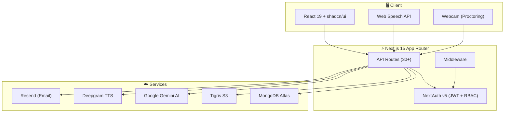
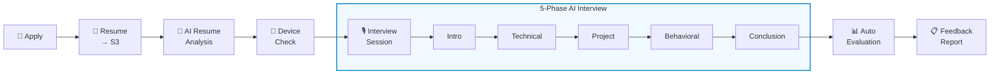

# Hiremantis: AI-Powered Recruitment Platform

[](https://nextjs.org)
[](https://www.typescriptlang.org)
[](https://www.mongodb.com)
[](https://tailwindcss.com)
[](./LICENSE)

**Hiremantis** is a full-stack, AI-driven recruitment platform that streamlines the entire hiring funnel — from job posting to AI-conducted technical interviews and automated candidate evaluation — for three roles: **Admin**, **Recruiter**, and **Candidate**.

> Built by [Raghav Gupta](https://www.linkedin.com/in/raghav-gupta-035b4a292/) & [Priyanshu Anand](https://www.linkedin.com/in/priyans11/)

---

## ✨ Highlights

| Feature            | Description                                                                       |
| ------------------ | --------------------------------------------------------------------------------- |
| 🤖 AI Interviews   | Gemini AI conducts technical, behavioral & project-based interviews               |
| 🎙️ Voice I/O       | Real-time speech recognition + Deepgram TTS for a conversational experience       |
| 📹 Proctoring      | Webcam & window-focus monitoring during live interview sessions                   |
| 📊 Auto Evaluation | Instant scoring on technical skills, communication, problem-solving & culture fit |
| 🌐 Multi-language  | Full i18n support (English & Hindi, extensible)                                   |
| 🔒 RBAC            | Separate flows and dashboards for Admin, Recruiter, and Candidate                 |
| 📁 S3 Storage      | Resume, audio & image storage via AWS S3-compatible buckets                       |
| ✉️ Email           | Transactional emails via Resend for waitlist, contact, and admin alerts           |

---

## Architecture



### AI Interview Pipeline



> 📖 See [docs/architecture.md](./docs/architecture.md) for a detailed breakdown.

---

## Tech Stack

| Layer          | Technologies                                                                                                                     |
| -------------- | -------------------------------------------------------------------------------------------------------------------------------- |
| **Frontend**   | Next.js 15 (App Router, Turbopack), React 19, TypeScript 5, Tailwind CSS v4, shadcn/ui, Framer Motion, TanStack Query, next-intl |
| **Backend**    | NextAuth v5 (JWT), MongoDB + Mongoose, AWS S3 (Tigris), Server Actions, Zod, bcryptjs                                            |
| **AI & Media** | Google Gemini AI (gemini-2.0-flash), Deepgram TTS (aura-2-thalia-en), Web Speech API                                             |
| **Email**      | Resend + React Email                                                                                                             |
| **Analytics**  | PostHog, Microsoft Clarity, Vercel Analytics                                                                                     |
| **Tooling**    | pnpm, Husky, commitlint, ESLint, Prettier, lint-staged                                                                           |

---

## Quick Start

```bash
# 1. Clone & install
git clone https://github.com/priyanshwho/Hiremantis.git
cd Hiremantis
pnpm install

# 2. Configure environment
cp .env.example .env.local   # fill in your values — see docs/deployment.md

# 3. Verify setup
pnpm tsx scripts/verify-setup.ts

# 4. Create first admin
pnpm tsx scripts/create-admin.ts "Admin Name" "admin@example.com" "password"

# 5. Start dev server
pnpm dev
```

Open [http://localhost:3000](http://localhost:3000). For full environment variable reference, see [docs/deployment.md](./docs/deployment.md).

---

## Roles

| Role          | What they can do                                                                                                   |
| ------------- | ------------------------------------------------------------------------------------------------------------------ |
| **Recruiter** | Post jobs, AI-generate descriptions, review applications & resumes, trigger AI interviews, view evaluation reports |
| **Candidate** | Browse job board, apply with resume upload, take AI voice interviews, track application status                     |
| **Admin**     | Full platform management — users, jobs, applications, analytics, waitlist, access control                          |

> Admin accounts are created via CLI only: `pnpm tsx scripts/create-admin.ts`

---

## Roadmap

**Done ✅** — Auth + RBAC, job & application lifecycle, AI interview (Gemini + Deepgram), resume parsing & scoring, interview proctoring, multi-language (en/hi), waitlist system, analytics

**Planned 🚧** — Mobile app, calendar integration, video recording & playback, ATS integrations (Greenhouse, Lever), advanced analytics, drag-and-drop pipeline board

---

## Documentation

|     | Document                                                        |                                               |
| --- | --------------------------------------------------------------- | --------------------------------------------- |
| 📘  | [Architecture](./docs/architecture.md)                          | System design, folder structure, request flow |
| 🚀  | [Deployment](./docs/deployment.md)                              | Environment variables, setup, infrastructure  |
| 🤝  | [Contributing](./docs/contributing.md)                          | Dev workflow, commits, PR process             |
| 🔒  | [Authentication](./docs/internal/authentication.md)             | Auth flow, RBAC, route guards                 |
| 🌐  | [API Reference](./docs/internal/api-reference.md)               | All 30+ endpoints                             |
| 🤖  | [AI Interview System](./docs/internal/ai-interview-system.md)   | Pipeline, hooks, evaluation                   |
| 🗄️  | [Data Models](./docs/internal/data-models.md)                   | Schemas, relationships, ER diagram            |
| 🧩  | [Components](./docs/internal/components.md)                     | Component library & patterns                  |
| ✉️  | [Email System](./docs/internal/email-system.md)                 | Templates & Resend integration                |
| 🌍  | [Internationalization](./docs/internal/internationalization.md) | i18n setup & adding languages                 |

---

## Contributing

See the [Contributing Guide](./docs/contributing.md) for full details on workflow, commit conventions, and the PR process.

```bash
git checkout -b feature/your-feature
git commit -m 'feat: your feature description'
git push origin feature/your-feature
# → open a Pull Request
```

---

## License

**MIT** — see [LICENSE](./LICENSE) for details.

_Authors: [Raghav Gupta](https://www.linkedin.com/in/raghav-gupta-035b4a292/) & [Priyanshu Anand](https://www.linkedin.com/in/priyans11/)_
