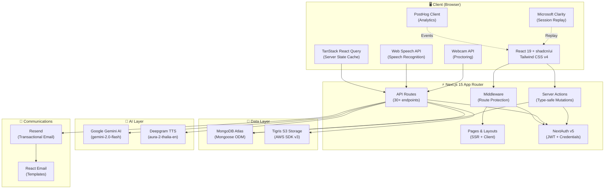
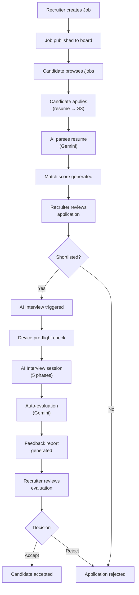

# Architecture

This document describes the overall system architecture, technology choices, folder structure, and request flow of Hiremantis.

## Table of Contents

- [High-Level Overview](#high-level-overview)
- [System Architecture Diagram](#system-architecture-diagram)
- [Technology Stack](#technology-stack)
- [Folder Structure](#folder-structure)
- [Request Flow](#request-flow)
- [Core Application Flow](#core-application-flow)
- [Key Design Decisions](#key-design-decisions)

---

## High-Level Overview

Hiremantis is a **monolithic Next.js 15 application** using the App Router pattern. It serves three user roles (Admin, Recruiter, Candidate) through a single deployment, with role-based access control at the middleware and API layers.

The application follows a **full-stack architecture** where:

- **Frontend** pages are server-rendered with React 19 and hydrated on the client
- **Backend** logic lives in API routes and Server Actions within the same Next.js app
- **External services** (MongoDB, S3, Gemini AI, Deepgram, Resend) are accessed server-side only
- **State management** uses TanStack React Query for server state and React hooks for local state

---

## System Architecture Diagram



---

## Technology Stack

### Frontend

| Technology           | Version | Purpose                                            |
| -------------------- | ------- | -------------------------------------------------- |
| Next.js              | 15.3.x  | Full-stack React framework (App Router, Turbopack) |
| React                | 19.x    | UI library with server components                  |
| TypeScript           | 5.x     | Type safety across the codebase                    |
| Tailwind CSS         | v4      | Utility-first styling                              |
| shadcn/ui            | Latest  | 53+ accessible UI components (Radix-based)         |
| Framer Motion        | 12.x    | Animations and transitions                         |
| TanStack React Query | 5.x     | Server state management and caching                |
| next-intl            | 4.x     | Internationalization framework                     |
| Recharts             | 2.x     | Analytics charts and data visualization            |
| nuqs                 | 2.x     | Type-safe URL search params                        |

### Backend

| Technology         | Version       | Purpose                                   |
| ------------------ | ------------- | ----------------------------------------- |
| NextAuth (Auth.js) | 5.0.0-beta.28 | Authentication with JWT strategy          |
| Mongoose           | 8.x           | MongoDB ODM with schema validation        |
| AWS SDK v3         | 3.x           | S3-compatible storage client              |
| Zod                | 3.x           | Runtime validation and schema enforcement |
| bcryptjs           | 3.x           | Password hashing (10 rounds)              |

### AI & Media

| Technology                           | Purpose                                          |
| ------------------------------------ | ------------------------------------------------ |
| Google Gemini AI (via Vercel AI SDK) | Interview questions, resume analysis, evaluation |
| Deepgram API                         | Text-to-speech for AI interviewer                |
| Web Speech API (browser)             | Real-time speech recognition                     |

### DevOps & Tooling

| Technology        | Purpose                             |
| ----------------- | ----------------------------------- |
| pnpm              | Package manager (workspace support) |
| Turbopack         | Development bundler (via Next.js)   |
| Husky             | Git hooks                           |
| commitlint        | Conventional commit enforcement     |
| lint-staged       | Pre-commit file linting             |
| ESLint + Prettier | Code quality and formatting         |
| PostHog           | Product analytics                   |
| Microsoft Clarity | Session replays and heatmaps        |
| Vercel Analytics  | Performance monitoring              |

---

## Folder Structure

```
hiremantis/
├── docs/                       # 📖 Project documentation
├── public/                     # Static assets
│   ├── images/                 #   Logos, icons, illustrations
│   ├── patterns/               #   Background patterns
│   └── manifest.json           #   PWA manifest
├── scripts/                    # CLI utilities
│   ├── create-admin.ts         #   Create admin user accounts
│   ├── test-gemini-api.ts      #   Verify Gemini AI connectivity
│   └── verify-setup.ts         #   Validate environment configuration
└── src/                        # Application source code
    ├── auth.ts                 # NextAuth configuration (providers, callbacks, guards)
    ├── middleware.ts            # Request middleware (route matching)
    ├── actions/                # Server Actions
    │   └── jobs.ts             #   Job-related server mutations
    ├── app/                    # Next.js App Router
    │   ├── layout.tsx          #   Root layout (providers, fonts, metadata)
    │   ├── page.tsx            #   Landing page
    │   ├── globals.css         #   Global styles
    │   ├── api/                #   API routes (30+ endpoints)
    │   │   ├── admin/          #     Admin management
    │   │   ├── ai/             #     AI interview & generation (7 endpoints)
    │   │   ├── applications/   #     Application CRUD & analysis
    │   │   ├── auth/           #     NextAuth handler + login
    │   │   ├── contact/        #     Contact form
    │   │   ├── dashboard/      #     Dashboard statistics
    │   │   ├── files/          #     S3 signed URL generation
    │   │   ├── jobs/           #     Job CRUD & listings
    │   │   ├── upload/         #     File upload handler
    │   │   └── wishlist/       #     Waitlist management
    │   ├── dashboard/          #   Dashboard pages (role-segmented)
    │   │   ├── (admin)/        #     Admin-only: users, jobs, contacts, wishlist
    │   │   ├── (candidate)/    #     Candidate: jobs, applications, interviews
    │   │   └── (recruiters)/   #     Recruiter: job listings, applications
    │   ├── jobs/               #   Public job board
    │   ├── login/              #   Login pages (per role)
    │   ├── register/           #   Registration pages
    │   └── ...                 #   About, contact, learn-more, etc.
    ├── components/             # React components
    │   ├── ui/                 #   53+ shadcn/ui primitives
    │   ├── interview/          #   23 interview UI components
    │   ├── jobs/               #   11 job-related components
    │   ├── dashboard/          #   9 dashboard components
    │   ├── auth/               #   4 auth components
    │   ├── applications/       #   3 application components
    │   ├── admin/              #   2 admin components
    │   └── job-applications/   #   Job application filter
    ├── constants/              # Application constants
    │   ├── interview-alerts.ts #   Interview warning/error messages
    │   ├── interview-questions.ts # Question bank configuration
    │   └── speech-recognition-config.ts # Speech API settings
    ├── data/                   # Static reference data
    │   ├── countries.ts        #   Country list
    │   └── technical-skills.ts #   Technical skills taxonomy
    ├── hooks/                  # Custom React hooks (11 hooks)
    │   ├── use-interview-chat.tsx  # Core interview chat logic
    │   ├── use-interview-state.ts  # Interview state polling
    │   ├── use-ai-agent-state.ts   # AI avatar state machine
    │   ├── use-audio-*.ts          # Audio playback management
    │   ├── use-dashboard-stats.ts  # Dashboard data fetching
    │   └── ...
    ├── i18n/                   # Internationalization
    │   ├── config.ts           #   Locale definitions
    │   ├── request.ts          #   Request-level locale loading
    │   ├── service.ts          #   Locale get/set actions
    │   └── lang/               #   Translation files (en.json, hi.json)
    ├── lib/                    # Shared utilities
    │   ├── mongodb.ts          #   Mongoose connection (singleton)
    │   ├── s3-client.ts        #   S3 client configuration
    │   ├── ai-utils.ts         #   Gemini AI wrapper
    │   ├── deepgram-tts.ts     #   Text-to-speech integration
    │   ├── auth-utils.tsx      #   Auth helper components
    │   ├── config.ts           #   App configuration
    │   ├── email/              #   Email rendering + 5 templates
    │   ├── validations/        #   Zod validation schemas
    │   └── ...                 #   Audio, file, search, session utils
    ├── models/                 # Mongoose models (6 models)
    │   ├── user.ts             #   User (admin/recruiter/candidate)
    │   ├── job.ts              #   Job posting
    │   ├── job-application.ts  #   Application + interview state
    │   ├── interview-state.ts  #   Interview phase tracking
    │   ├── contact.ts          #   Contact form submission
    │   └── wishlist.ts         #   Waitlist entry
    ├── provider/               # React context providers
    │   ├── root-provider.tsx   #   Composition root (all providers)
    │   ├── _theme-provider.tsx #   Dark/light theme
    │   ├── _react-query-provider.tsx # TanStack Query
    │   ├── _posthog-provider.tsx    # PostHog analytics
    │   └── _header-title-provider.tsx # Dynamic page titles
    └── types/                  # TypeScript declarations
        ├── global.d.ts         #   Global type extensions
        ├── next-auth.d.ts      #   NextAuth session type augmentation
        └── react-mic.d.ts      #   react-mic module declaration
```

---

## Request Flow

### Page Request (SSR)

```
Browser → Middleware (route matching) → NextAuth authorized callback
  → Route guard (role check) → Page component (server render)
  → Client hydration (providers, hooks, interactivity)
```

### API Request

```
Browser/TanStack Query → API Route handler
  → Auth session validation (getServerSession)
  → Request validation (Zod)
  → Business logic (DB queries, AI calls, S3 operations)
  → JSON response
```

### Server Action

```
Client component → Server Action function
  → Auth check → Validation → DB mutation → Revalidation
```

---

## Core Application Flow



---

## Key Design Decisions

### Why Next.js App Router?

- **Colocation**: Pages, API routes, and layouts live together, reducing context switching
- **Server Components**: Reduce client bundle size by rendering data-fetching logic on the server
- **Streaming**: Layouts and loading states give instant feedback while data loads
- **Built-in API routes**: No need for a separate backend server

### Why MongoDB + Mongoose?

- **Flexible schema**: Job listings and applications have varying fields across use cases
- **Embedded documents**: Interview state is embedded directly in the application document, avoiding joins
- **Mongoose ODM**: Provides schema validation, middleware hooks (e.g., password hashing), and a familiar API
- **Edge Runtime guard**: Models check the runtime environment before registering to avoid edge bundling issues

### Why JWT over Database Sessions?

- **Stateless**: No session table to query on every request
- **Performance**: Token validation is local and fast
- **Scalability**: Works across serverless function instances without shared state
- **Trade-off**: Revocation requires token expiry rather than instant invalidation

### Why Tigris S3 over Direct Cloud Storage?

- **S3 API compatibility**: Standard AWS SDK works seamlessly
- **Cost-effective**: Competitive pricing for startup-scale storage
- **Path-style access**: Simplified URL handling for presigned URLs

### Why Vercel AI SDK for Gemini?

- **Unified interface**: Swap AI providers without changing application code
- **Streaming support**: Built-in streaming for chat responses
- **Type safety**: TypeScript-first API with proper inference
