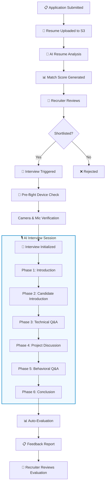
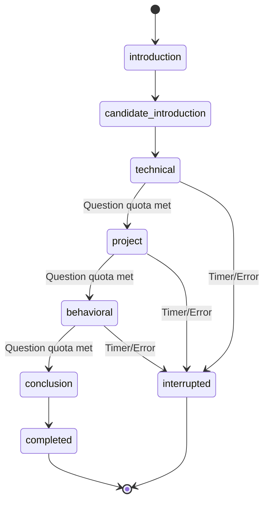
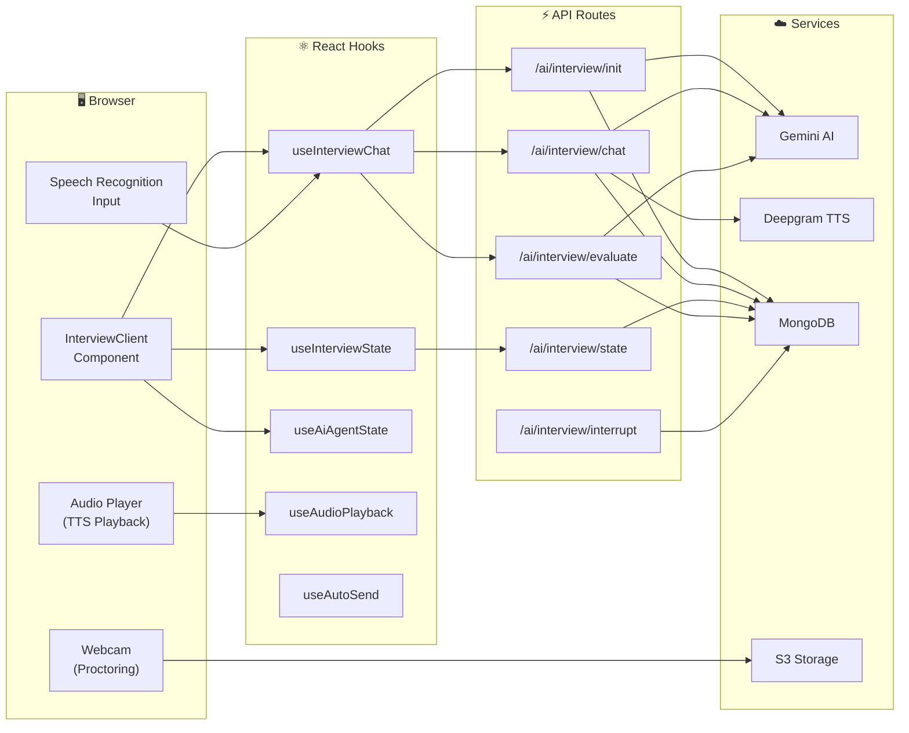

# AI Interview System

This document provides an in-depth look at the AI-powered interview system — the core feature of Hiremantis.

## Table of Contents

- [Overview](#overview)
- [Interview Pipeline](#interview-pipeline)
- [Interview Phases](#interview-phases)
- [Architecture Diagram](#architecture-diagram)
- [API Endpoints](#api-endpoints)
- [Client-Side Hooks](#client-side-hooks)
- [Speech & Audio](#speech--audio)
- [Proctoring & Monitoring](#proctoring--monitoring)
- [Evaluation System](#evaluation-system)
- [Interview Components](#interview-components)
- [Session State Management](#session-state-management)
- [Configuration](#configuration)

---

## Overview

The AI interview system conducts fully automated technical, behavioral, and project-based interviews using:

- **Google Gemini AI** (gemini-2.0-flash) for question generation, conversation, and evaluation
- **Deepgram TTS** (aura-2-thalia-en) for AI voice responses
- **Web Speech API** for real-time candidate speech recognition
- **Webcam API** for attention monitoring and proctoring

Interviews support both text input and voice responses, providing a natural conversational experience.

---

## Interview Pipeline



---

## Interview Phases

The interview progresses through a defined state machine:

| Phase | Name                     | Description                                               | Question Count |
| ----- | ------------------------ | --------------------------------------------------------- | -------------- |
| 1     | `introduction`           | AI introduces itself and explains the interview format    | —              |
| 2     | `candidate_introduction` | Candidate introduces themselves                           | —              |
| 3     | `technical`              | Technical questions tailored to job requirements          | Configurable   |
| 4     | `project`                | Discussion about candidate's past projects and experience | Configurable   |
| 5     | `behavioral`             | Behavioral and situational questions                      | Configurable   |
| 6     | `conclusion`             | AI wraps up and thanks the candidate                      | —              |
| ✅    | `completed`              | Interview finished successfully                           | —              |
| ⚠️    | `interrupted`            | Interview forcefully ended (timer, error, or user action) | —              |

### Phase Transitions



Phase transitions happen automatically when the question count for a category reaches the configured limit. The AI system prompt instructs Gemini to track and transition phases.

---

## Architecture Diagram



---

## API Endpoints

See [API Reference — AI & Interview](./api-reference.md#ai--interview) for complete endpoint documentation.

| Endpoint                         | Method | Purpose                         |
| -------------------------------- | ------ | ------------------------------- |
| `/api/ai/interview/init`         | POST   | Initialize interview session    |
| `/api/ai/interview/chat`         | POST   | Send/receive interview messages |
| `/api/ai/interview/state`        | GET    | Poll current interview state    |
| `/api/ai/interview/history`      | GET    | Retrieve full chat history      |
| `/api/ai/interview/evaluate`     | POST   | Generate evaluation report      |
| `/api/ai/interview/autoevaluate` | POST   | Auto-evaluate on completion     |
| `/api/ai/interview/interrupt`    | POST   | Force-end interview             |

---

## Client-Side Hooks

### `useInterviewChat` (~534 lines)

The core hook managing the entire interview chat experience.

**Responsibilities:**

- Message state management (local + server sync)
- Interview initialization (new or resume existing)
- Message sending via `/api/ai/interview/chat`
- Conversation history tracking
- Audio URL lifecycle management
- Quota/rate limit error handling
- Completion detection and evaluation triggering
- Session state persistence via `SessionStateManager`

**Key State:**

```typescript
{
  messages: Message[]        // Chat message array
  isLoading: boolean         // Processing indicator
  isInitializing: boolean    // Initial load state
  error: string | null       // Error message
  isCompleted: boolean       // Interview finished flag
  interviewState: object     // Current phase/progress
}
```

**Key Functions:**

- `initializeInterview()` — Load existing or start new session
- `sendMessage(text)` — Send candidate response, receive AI reply
- `restartInterview()` — Reset and begin fresh
- `addAudioUrl(url)` — Track blob URLs for cleanup

---

### `useInterviewState` (~159 lines)

Polls the interview state endpoint at regular intervals.

**Behavior:**

- Polls `/api/ai/interview/state` periodically
- **Pauses polling** when audio is playing or chat is loading (avoids race conditions)
- Detects completion/interruption and stops polling
- Provides current phase, question counts, and feedback data

**Key State:**

```typescript
{
  interviewState: InterviewState | null;
  isCompleted: boolean;
  isInterrupted: boolean;
  feedback: EvaluationFeedback | null;
}
```

---

### `useAiAgentState`

Simple state machine driving the AI avatar visual feedback.

```
States: idle → thinking → speaking
Transitions:
  - isLoading=true  → "thinking" (loading spinner)
  - isPlaying=true  → "speaking" (voice animation)
  - otherwise       → "idle"
```

---

### `useAudioAutoplay`

Automatically plays AI audio responses when they arrive. Manages the audio element and playback events.

---

### `useAudioPlaybackState`

Tracks whether AI-generated audio is currently playing. Used by `useInterviewState` to pause polling during playback.

---

### `useAutoSend`

Implements an auto-send timer for interview responses. If a candidate pauses too long, the response is automatically submitted.

---

## Speech & Audio

### Speech Recognition (Input)

- Uses the **Web Speech API** (`webkitSpeechRecognition` / `SpeechRecognition`)
- Configuration in `src/constants/speech-recognition-config.ts`
- Continuous recognition with interim results
- Language support based on interview preference
- Visual feedback via `SpeechVisualizer` and `VoiceIndicator` components

### Text-to-Speech (Output)

- Uses **Deepgram API** with the `aura-2-thalia-en` model
- Two modes:
  - **Client-side**: `textToSpeech()` — fetches audio and returns blob URL
  - **Server-side**: `serverTextToSpeech()` — returns Buffer for API response
- `AudioUrlManager` class prevents blob URL memory leaks by tracking and revoking URLs
- Audio playback via custom `AudioPlayer` component with `AudioCleanup` for lifecycle management

### Audio Flow

```
AI generates text response
  → Server calls Deepgram TTS API
  → Audio buffer returned in API response
  → Client creates blob URL
  → AudioPlayer component plays audio
  → AudioUrlManager tracks URL for cleanup
  → Blob URL revoked when no longer needed
```

---

## Proctoring & Monitoring

### Webcam Monitoring

- Captures webcam frames at configurable intervals during the interview
- Images uploaded to S3 storage
- Monitoring can be enabled/disabled per application
- Images retrievable via `/api/applications/[id]/monitoring-image/[key]`

### Tab/Window Focus Detection

- Detects when candidate switches tabs or minimizes the browser
- Interruptions are logged with timestamps
- Excessive interruptions can trigger interview termination
- Data stored in the `InterviewState` embedded document

### Configuration

Monitoring settings per application:

- `monitoringEnabled`: boolean toggle
- `monitoringImages`: array of S3 keys for captured frames
- Capture interval: configurable in constants

---

## Evaluation System

### Scoring Categories

Post-interview evaluation scores candidates across 5 dimensions:

| Category         | Description                                | Scale |
| ---------------- | ------------------------------------------ | ----- |
| Technical Skills | Domain knowledge and technical proficiency | 0–10  |
| Communication    | Clarity, articulation, and expression      | 0–10  |
| Problem Solving  | Analytical thinking and approach           | 0–10  |
| Culture Fit      | Alignment with company values and teamwork | 0–10  |
| Overall          | Weighted aggregate score                   | 0–10  |

### Evaluation Process

1. Interview reaches `conclusion` phase → marked as `completed`
2. Auto-evaluation triggered via `/api/ai/interview/autoevaluate`
3. Full chat history sent to Gemini AI with evaluation prompt
4. Gemini returns structured JSON with scores and feedback
5. Feedback includes:
   - Numerical scores per category
   - **Strengths**: specific positive observations
   - **Areas for improvement**: actionable feedback
6. Results stored in `interviewState.feedback` on the application document

### Manual Evaluation

Recruiters or admins can also trigger evaluation manually via:

- The evaluation button in the interview feedback UI
- Direct API call to `/api/ai/interview/evaluate`

---

## Interview Components

23 components in `src/components/interview/`:

| Component                             | Purpose                                |
| ------------------------------------- | -------------------------------------- |
| `interview-client.tsx`                | Main interview page client wrapper     |
| `interview-session.tsx`               | Active interview session layout        |
| `ai-interviewer-icon.tsx`             | Animated AI avatar with state feedback |
| `ai-interview-background.tsx`         | Themed interview background            |
| `speech-recognition-input.tsx`        | Speech-to-text input component         |
| `speech-visualizer.tsx`               | Audio waveform visualization           |
| `voice-indicator.tsx`                 | Microphone active indicator            |
| `audio-player.tsx`                    | TTS audio playback component           |
| `audio-cleanup.tsx`                   | Blob URL lifecycle management          |
| `custom-react-mic.tsx`                | Custom microphone recording component  |
| `device-check.tsx`                    | Pre-flight camera/mic verification     |
| `media-device-selector.tsx`           | Camera/mic device picker               |
| `interview-timer.tsx`                 | Countdown timer display                |
| `auto-send-timer.tsx`                 | Auto-submit countdown UI               |
| `typing-indicator.tsx`                | AI "thinking" animation                |
| `feedback-content.tsx`                | Evaluation results display             |
| `interview-completion.tsx`            | Interview finished screen              |
| `interview-details-dialog.tsx`        | Interview details modal                |
| `auto-generate-feedback.tsx`          | Trigger evaluation generation          |
| `auto-generate-feedback-enhanced.tsx` | Enhanced evaluation trigger            |

---

## Session State Management

Interview state is persisted across multiple layers:

### Server-Side (MongoDB)

- `InterviewState` embedded in `JobApplication` document
- Full chat history stored as `interviewChatHistory[]` array
- Phase progression, question counts, and timing data
- Feedback scores and evaluation results

### Client-Side (SessionStateManager)

- `src/lib/session-state-manager.ts` provides browser-level state persistence
- Handles network disconnections gracefully
- Syncs with server state on reconnection
- Prevents duplicate message sends

### Resumability

Interviews can be resumed if interrupted:

1. `useInterviewChat.initializeInterview()` checks for existing chat history
2. If history exists, loads previous messages and current phase
3. Interview continues from where it left off
4. No data loss from browser refreshes or network issues

---

## Configuration

### Interview Constants

- `src/constants/interview-questions.ts` — Question bank and category configuration
- `src/constants/interview-alerts.ts` — Warning and error messages shown during interviews
- `src/constants/speech-recognition-config.ts` — Speech API settings (language, continuous mode, interim results)

### Job-Level Configuration

- `interviewDuration`: 5–120 minutes per job posting
- Interview duration affects the timer and auto-interruption behavior

### Environment Variables

| Variable           | Required | Purpose              |
| ------------------ | -------- | -------------------- |
| `GOOGLE_API_KEY`   | ✅       | Gemini AI API key    |
| `DEEPGRAM_API_KEY` | ✅       | Deepgram TTS API key |
