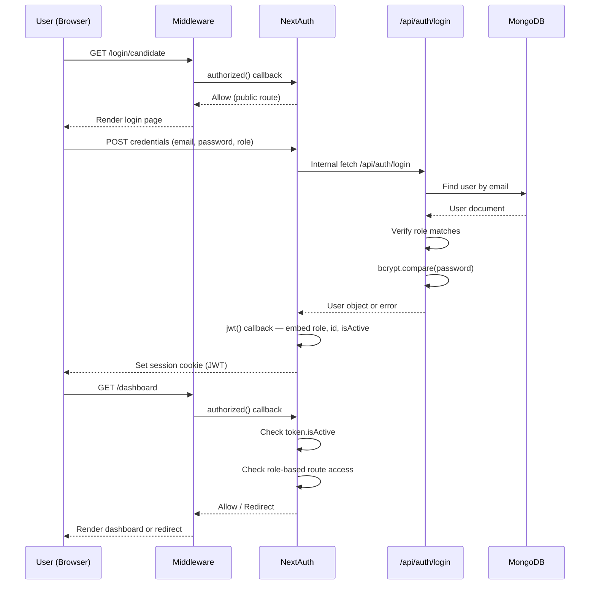

# Authentication & Authorization

This document covers the authentication flow, role-based access control (RBAC), session management, and route protection in Hiremantis.

## Table of Contents

- [Overview](#overview)
- [Authentication Stack](#authentication-stack)
- [Roles](#roles)
- [Auth Flow Diagram](#auth-flow-diagram)
- [NextAuth Configuration](#nextauth-configuration)
- [Route Protection](#route-protection)
- [Middleware](#middleware)
- [Session Management](#session-management)
- [Password Security](#password-security)
- [Registration & Waitlist](#registration--waitlist)
- [Admin Account Creation](#admin-account-creation)

---

## Overview

Hiremantis uses **NextAuth v5 (Auth.js)** with a **Credentials provider** and **JWT strategy**. Authentication is role-aware from login through to every protected route.

---

## Authentication Stack

| Component        | Technology                            | Purpose                       |
| ---------------- | ------------------------------------- | ----------------------------- |
| Provider         | Credentials (email + password + role) | Login validation              |
| Strategy         | JWT (not database sessions)           | Stateless session tokens      |
| Session maxAge   | 30 days                               | Token lifetime                |
| Password hashing | bcrypt (10 rounds)                    | Secure password storage       |
| Validation       | Zod                                   | Login form schema enforcement |
| Route protection | `authorized` callback + middleware    | Guard pages and API routes    |

---

## Roles

| Role        | Description            | Access Level                                             |
| ----------- | ---------------------- | -------------------------------------------------------- |
| `admin`     | Platform administrator | Full access — all routes, all data                       |
| `recruiter` | Hiring team member     | Job management, application review, interview management |
| `candidate` | Job seeker             | Job browsing, application submission, AI interviews      |

Admins implicitly have access to all recruiter and candidate routes.

---

## Auth Flow Diagram



---

## NextAuth Configuration

The auth configuration lives in `src/auth.ts` and is exported as `{ handlers, signIn, signOut, auth }`.

### Credentials Provider

```
Input: { email, password, role }
Validation: Zod schema (email format, non-empty password, valid role enum)
Flow:
  1. POST to /api/auth/login with { email, password, role }
  2. API validates against MongoDB
  3. Returns user object { id, name, email, role, isActive } or throws
```

### JWT Callback

The JWT callback enriches the token with user data on sign-in:

| Token Field | Source          | Purpose                   |
| ----------- | --------------- | ------------------------- |
| `role`      | `user.role`     | Role-based access control |
| `id`        | `user.id`       | User identification       |
| `isActive`  | `user.isActive` | Account status check      |

### Session Callback

Maps JWT token fields to the session object for client access:

- `session.user.role` ← `token.role`
- `session.user.id` ← `token.id`
- `session.user.isActive` ← `token.isActive`

---

## Route Protection

The `authorized` callback in NextAuth implements comprehensive route-level access control.

### Public Routes (No Auth Required)

| Route Pattern              | Description            |
| -------------------------- | ---------------------- |
| `/`                        | Landing page           |
| `/login`, `/login/*`       | All login pages        |
| `/register`, `/register/*` | All registration pages |
| `/learn-more`              | Feature information    |
| `/about`                   | About page             |
| `/contact`                 | Contact page           |
| `/privacy-policy`          | Privacy policy         |
| `/terms`                   | Terms of service       |
| `/jobs`                    | Public job board       |
| `/jobs/*`                  | Individual job pages   |
| `/api/contact`             | Contact form API       |
| `/api/wishlist`            | Waitlist API           |
| `/api/jobs/list`           | Public job listing API |
| `/api/jobs/[id]` (GET)     | Public job detail API  |
| `/api/register`            | Registration API       |

### Authenticated User Redirects

If an authenticated user visits `/login` or `/register`, they are automatically redirected to `/dashboard`.

### Disabled Account Handling

If `token.isActive === false`, the user is redirected to `/login?error=Account+is+disabled` and the session is effectively blocked.

### Role-Based Route Guards

| Route Pattern                      | Allowed Roles    |
| ---------------------------------- | ---------------- |
| `/dashboard/candidates`            | admin            |
| `/dashboard/recruiters`            | admin            |
| `/dashboard/manage-jobs`           | admin            |
| `/dashboard/contact-submissions`   | admin            |
| `/dashboard/wishlist`              | admin            |
| `/api/admin/*`                     | admin            |
| `/dashboard/job-listing`           | recruiter, admin |
| `/dashboard/job-applications`      | recruiter, admin |
| `/api/jobs` (POST)                 | recruiter, admin |
| `/api/ai/generate-job-description` | recruiter, admin |
| `/dashboard/jobs`                  | candidate, admin |
| `/dashboard/applications`          | candidate, admin |
| `/api/applications` (POST)         | candidate, admin |
| `/api/ai/interview/*`              | candidate, admin |

### Unauthorized Handling

Users who access routes outside their role are redirected to `/unauthorized`.

---

## Middleware

The middleware (`src/middleware.ts`) delegates all authorization logic to the NextAuth `authorized` callback. It applies to all routes **except**:

- `api` (handled separately)
- `_next/static` (static assets)
- `_next/image` (image optimization)
- `favicon.ico`
- `.svg` files

---

## Session Management

### Client-Side Access

```tsx
import { useSession } from 'next-auth/react';

const { data: session } = useSession();
// session.user.role → "admin" | "recruiter" | "candidate"
// session.user.id → MongoDB ObjectId string
// session.user.isActive → boolean
```

### Server-Side Access

```tsx
import { auth } from '@/auth';

const session = await auth();
// Same session shape as client-side
```

### Session Type Augmentation

The session types are extended in `src/types/next-auth.d.ts` to include `role`, `id`, and `isActive` on the user object.

---

## Password Security

- **Hashing algorithm**: bcrypt via `bcryptjs`
- **Salt rounds**: 10
- **Pre-save hook**: The `User` Mongoose model automatically hashes passwords on save (only when modified)
- **Comparison**: The model exposes a `comparePassword(candidatePassword)` instance method

---

## Registration & Waitlist

### Registration Flow

1. User submits registration form (`/register/candidate` or `/register/recruiter`)
2. API validates with Zod schema
3. Checks for existing user with same email
4. Creates user with hashed password and appropriate role
5. Returns success → user can log in

### Waitlist Mode

When `REGISTRATION_ENABLED=false` in environment:

1. Registration pages show a waitlist form instead
2. Submissions are stored in the `Wishlist` model
3. Confirmation email sent to user (via Resend)
4. Notification email sent to admin
5. Admin can view waitlist entries in the dashboard

---

## Admin Account Creation

Admin accounts **cannot** be created through the UI. Use the CLI script:

```bash
pnpm tsx scripts/create-admin.ts "Admin Name" "admin@example.com" "securepassword"
```

This script:

1. Connects to MongoDB using `MONGODB_URI`
2. Hashes the password with bcrypt
3. Creates a user with `role: "admin"` and `isActive: true`
4. Disconnects and reports success
