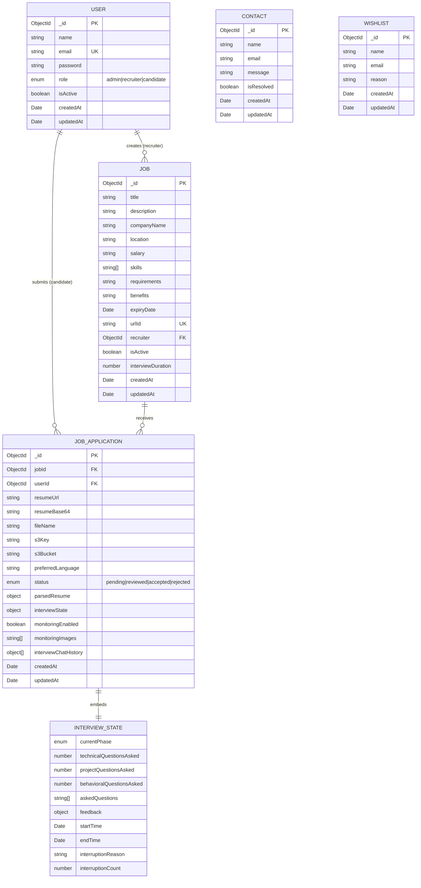

# Data Models

This document describes all Mongoose models, their schemas, relationships, and key behaviors.

## Table of Contents

- [Overview](#overview)
- [Entity Relationship Diagram](#entity-relationship-diagram)
- [User](#user)
- [Job](#job)
- [JobApplication](#jobapplication)
- [InterviewState](#interviewstate)
- [Contact](#contact)
- [Wishlist](#wishlist)
- [Edge Runtime Guard](#edge-runtime-guard)

---

## Overview

Hiremantis uses **MongoDB** with **Mongoose** as the ODM. There are 6 models, with `InterviewState` embedded as a subdocument within `JobApplication`.

All models live in `src/models/` and follow a consistent pattern:

1. Define the schema with Mongoose
2. Apply middleware (pre-save hooks, etc.)
3. Guard against Edge Runtime re-registration
4. Export the model

---

## Entity Relationship Diagram



---

## User

**File**: `src/models/user.ts`

### Schema

| Field      | Type          | Required | Default | Description                                |
| ---------- | ------------- | -------- | ------- | ------------------------------------------ |
| `name`     | String        | ✅       | —       | Full name                                  |
| `email`    | String        | ✅       | —       | Unique email (lowercase, trimmed)          |
| `password` | String        | ✅       | —       | Bcrypt-hashed password                     |
| `role`     | String (enum) | ✅       | —       | `"admin"`, `"recruiter"`, or `"candidate"` |
| `isActive` | Boolean       | —        | `true`  | Account status flag                        |

**Options**: `timestamps: true` (adds `createdAt`, `updatedAt`)

### Indexes

- `email`: unique index

### Middleware

**Pre-save hook**: Automatically hashes the password with bcrypt (10 rounds) when the `password` field is modified. Skips hashing if the password hasn't changed.

### Instance Methods

| Method            | Signature                                         | Description                                           |
| ----------------- | ------------------------------------------------- | ----------------------------------------------------- |
| `comparePassword` | `(candidatePassword: string) => Promise<boolean>` | Compares a plaintext password against the stored hash |

### Usage Notes

- Admin users can only be created via the CLI script (`scripts/create-admin.ts`)
- The `isActive` field is used for soft-deactivation; admin can toggle via the dashboard
- Role is immutable after creation (no role-change API)

---

## Job

**File**: `src/models/job.ts`

### Schema

| Field               | Type     | Required | Default | Description                           |
| ------------------- | -------- | -------- | ------- | ------------------------------------- |
| `title`             | String   | ✅       | —       | Job title                             |
| `description`       | String   | ✅       | —       | Full job description                  |
| `companyName`       | String   | ✅       | —       | Hiring company name                   |
| `location`          | String   | ✅       | —       | Job location                          |
| `salary`            | String   | —        | —       | Salary range text                     |
| `skills`            | [String] | ✅       | —       | Required skills array                 |
| `requirements`      | String   | —        | —       | Additional requirements               |
| `benefits`          | String   | —        | —       | Job benefits                          |
| `expiryDate`        | Date     | —        | —       | Listing expiry date                   |
| `urlId`             | String   | ✅       | —       | Unique URL-safe slug                  |
| `recruiter`         | ObjectId | ✅       | —       | Reference to User (recruiter)         |
| `isActive`          | Boolean  | —        | `true`  | Listing visibility                    |
| `interviewDuration` | Number   | —        | `30`    | Interview duration in minutes (5–120) |

**Options**: `timestamps: true`

### Indexes

- `urlId`: unique index
- `recruiter`: indexed for queries

### Relationships

- **Belongs to** User (via `recruiter` field, `ref: 'User'`)
- **Has many** JobApplications (via `jobId` on JobApplication)

---

## JobApplication

**File**: `src/models/job-application.ts`

This is the most complex model, tracking the entire lifecycle from application to interview completion.

### Schema

| Field                  | Type          | Required | Default     | Description                                           |
| ---------------------- | ------------- | -------- | ----------- | ----------------------------------------------------- |
| `jobId`                | ObjectId      | ✅       | —           | Reference to Job                                      |
| `userId`               | ObjectId      | ✅       | —           | Reference to User (candidate)                         |
| `resumeUrl`            | String        | ✅       | —           | S3 URL of uploaded resume                             |
| `resumeBase64`         | String        | —        | —           | Base64-encoded resume (for AI parsing)                |
| `fileName`             | String        | ✅       | —           | Original file name                                    |
| `s3Key`                | String        | —        | —           | S3 object key                                         |
| `s3Bucket`             | String        | —        | —           | S3 bucket name                                        |
| `preferredLanguage`    | String        | —        | `"en"`      | Interview language preference                         |
| `status`               | String (enum) | —        | `"pending"` | `"pending"`, `"reviewed"`, `"accepted"`, `"rejected"` |
| `parsedResume`         | Object        | —        | —           | AI-extracted resume data (see below)                  |
| `interviewState`       | Object        | —        | —           | Embedded InterviewState (see below)                   |
| `monitoringEnabled`    | Boolean       | —        | `false`     | Webcam monitoring toggle                              |
| `monitoringImages`     | [String]      | —        | `[]`        | S3 keys for captured frames                           |
| `interviewChatHistory` | [Object]      | —        | `[]`        | Full chat message history                             |

**Options**: `timestamps: true`

### Parsed Resume Structure

```typescript
{
  text: string;           // Extracted resume text
  skills: string[];       // Identified skills
  experience: string;     // Experience summary
  education: string;      // Education summary
  matchScore: number;     // AI match score (0-100)
  aiComments: string;     // AI analysis commentary
}
```

### Chat History Entry

```typescript
{
  role: 'user' | 'assistant' | 'system';
  content: string;
  timestamp: Date;
}
```

### Relationships

- **Belongs to** Job (via `jobId`)
- **Belongs to** User (via `userId`)
- **Embeds** InterviewState

---

## InterviewState

**File**: `src/models/interview-state.ts`

This is not a standalone collection — it's embedded as a subdocument within `JobApplication`.

### Schema

| Field                      | Type          | Default          | Description                             |
| -------------------------- | ------------- | ---------------- | --------------------------------------- |
| `currentPhase`             | String (enum) | `"introduction"` | Current interview phase                 |
| `technicalQuestionsAsked`  | Number        | `0`              | Count of technical questions            |
| `projectQuestionsAsked`    | Number        | `0`              | Count of project questions              |
| `behavioralQuestionsAsked` | Number        | `0`              | Count of behavioral questions           |
| `askedQuestions`           | [String]      | `[]`             | Track asked questions to avoid repeats  |
| `feedback`                 | Object        | —                | Evaluation results (see below)          |
| `startTime`                | Date          | —                | Interview start timestamp               |
| `endTime`                  | Date          | —                | Interview end timestamp                 |
| `interruptionReason`       | String        | —                | Why the interview was interrupted       |
| `interruptionCount`        | Number        | `0`              | Number of focus/attention interruptions |

### Phase Enum Values

```
"introduction" | "candidate_introduction" | "technical" | "project" |
"behavioral" | "conclusion" | "completed" | "interrupted"
```

### Feedback Structure

```typescript
{
  technicalSkills: number;    // 0-10
  communication: number;      // 0-10
  problemSolving: number;     // 0-10
  cultureFit: number;         // 0-10
  overall: number;            // 0-10
  strengths: string[];        // List of positive observations
  improvements: string[];     // List of areas to improve
}
```

---

## Contact

**File**: `src/models/contact.ts`

### Schema

| Field        | Type    | Required | Default | Description           |
| ------------ | ------- | -------- | ------- | --------------------- |
| `name`       | String  | ✅       | —       | Sender's name         |
| `email`      | String  | ✅       | —       | Sender's email        |
| `message`    | String  | ✅       | —       | Message content       |
| `isResolved` | Boolean | —        | `false` | Admin resolution flag |

**Options**: `timestamps: true`

---

## Wishlist

**File**: `src/models/wishlist.ts`

### Schema

| Field    | Type   | Required | Default | Description            |
| -------- | ------ | -------- | ------- | ---------------------- |
| `name`   | String | ✅       | —       | Name                   |
| `email`  | String | ✅       | —       | Email address          |
| `reason` | String | —        | —       | Why they're interested |

**Options**: `timestamps: true`

---

## Edge Runtime Guard

All models include a guard pattern to prevent Mongoose model re-registration when running in Edge Runtime environments (e.g., middleware):

```typescript
// Pattern used in all model files:
const Model = mongoose.models.ModelName || mongoose.model('ModelName', schema);
export default Model;
```

This is necessary because:

1. Next.js middleware runs in the Edge Runtime where Mongoose can't initialize
2. Hot Module Replacement (HMR) in development can re-execute model files
3. The `mongoose.models` check prevents "Cannot overwrite model" errors
