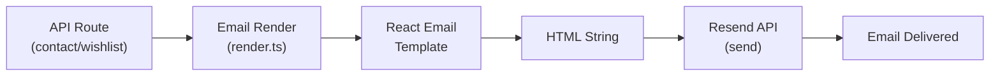

# Email System

This document covers the transactional email setup, templates, and triggers in Hiremantis.

## Table of Contents

- [Overview](#overview)
- [Architecture](#architecture)
- [Templates](#templates)
- [Email Triggers](#email-triggers)
- [Implementation Details](#implementation-details)
- [Adding a New Email Template](#adding-a-new-email-template)
- [Configuration](#configuration)

---

## Overview

Hiremantis uses **Resend** for transactional email delivery and **React Email** for template rendering. The system sends automated emails for:

- Waitlist signup confirmations
- Contact form confirmations
- Admin notifications for new submissions

---

## Architecture



### File Structure

```
src/lib/email/
├── render.ts              # Render functions for each template
└── templates/
    ├── BaseTemplate.tsx           # Shared layout/styling
    ├── WaitlistConfirmationEmail.tsx    # User waitlist confirmation
    ├── AdminNotificationEmail.tsx       # Admin notification
    ├── ContactConfirmationEmail.tsx     # User contact confirmation
    └── ContactNotificationEmail.tsx     # Admin contact notification
```

---

## Templates

### Base Template (`BaseTemplate.tsx`)

Shared layout component used by all email templates. Provides:

- Consistent header with Hiremantis branding
- Responsive container styling
- Footer with links and copyright
- Common typography styles

### Waitlist Confirmation (`WaitlistConfirmationEmail.tsx`)

**Sent to**: User who signed up for the waitlist

**Content**:

- Confirmation that their signup was received
- Their submitted name and reason
- Expectation-setting for when registration opens
- Platform overview

**Props**: `{ name: string }`

### Admin Notification (`AdminNotificationEmail.tsx`)

**Sent to**: Admin email (`ADMIN_EMAIL` env var)

**Content**:

- New waitlist signup alert
- Submitter details (name, email, reason)
- Link to admin dashboard

**Props**: `{ name: string, email: string, reason: string }`

### Contact Confirmation (`ContactConfirmationEmail.tsx`)

**Sent to**: User who submitted a contact form

**Content**:

- Confirmation that their message was received
- Copy of their submitted message
- Expected response timeline

**Props**: `{ name: string }`

### Contact Notification (`ContactNotificationEmail.tsx`)

**Sent to**: Admin email

**Content**:

- New contact form submission alert
- Submitter details (name, email, message)
- Link to admin contact submissions page

**Props**: `{ name: string, email: string, message: string }`

---

## Email Triggers

| Event                                  | User Email               | Admin Email             |
| -------------------------------------- | ------------------------ | ----------------------- |
| Waitlist signup (`POST /api/wishlist`) | ✅ Waitlist Confirmation | ✅ Admin Notification   |
| Contact form (`POST /api/contact`)     | ✅ Contact Confirmation  | ✅ Contact Notification |

### Trigger Flow

```
User submits form
  → API validates input (Zod)
  → Save to MongoDB (Contact/Wishlist model)
  → Render user confirmation email
  → Send via Resend to user
  → Render admin notification email
  → Send via Resend to admin
  → Return success response
```

Both emails are sent in parallel — failure of one doesn't block the other. The API route catches email errors and logs them without failing the overall request.

---

## Implementation Details

### Render Functions (`render.ts`)

Each template has a corresponding render function that:

1. Instantiates the React Email component with props
2. Renders it to an HTML string using `@react-email/render`
3. Returns the HTML for Resend to deliver

```typescript
import { render } from '@react-email/render';
import WaitlistConfirmationEmail from './templates/WaitlistConfirmationEmail';

export async function renderWaitlistConfirmation(name: string) {
  return render(<WaitlistConfirmationEmail name={name} />);
}
```

### Sending with Resend

```typescript
import { Resend } from 'resend';

const resend = new Resend(process.env.RESEND_API_KEY);

await resend.emails.send({
  from: 'Hiremantis <noreply@yourdomain.com>',
  to: userEmail,
  subject: 'Your waitlist signup is confirmed!',
  html: renderedHtml,
});
```

---

## Adding a New Email Template

### Step 1: Create the Template

Create a new file in `src/lib/email/templates/`:

```tsx
// src/lib/email/templates/NewTemplate.tsx
import { BaseTemplate } from './BaseTemplate';

interface NewTemplateProps {
  name: string;
  // ... other props
}

export default function NewTemplate({ name }: NewTemplateProps) {
  return (
    <BaseTemplate>
      <h1>Hello, {name}!</h1>
      {/* Template content */}
    </BaseTemplate>
  );
}
```

### Step 2: Add Render Function

Add a render function in `src/lib/email/render.ts`:

```typescript
import NewTemplate from './templates/NewTemplate';

export async function renderNewTemplate(name: string) {
  return render(<NewTemplate name={name} />);
}
```

### Step 3: Call from API Route

Use the render function in the appropriate API route:

```typescript
const html = await renderNewTemplate(name);

await resend.emails.send({
  from: 'Hiremantis <noreply@yourdomain.com>',
  to: recipient,
  subject: 'Subject Line',
  html,
});
```

---

## Configuration

### Required Environment Variables

| Variable         | Description                           |
| ---------------- | ------------------------------------- |
| `RESEND_API_KEY` | Resend API key for sending emails     |
| `ADMIN_EMAIL`    | Admin email address for notifications |

### Resend Setup

1. Sign up at [resend.com](https://resend.com)
2. Verify a sending domain (required for production)
3. In development, Resend provides a test domain
4. Create an API key and set `RESEND_API_KEY`

### Notes

- Emails fail gracefully — a failed send won't crash the API request
- All templates use React Email's cross-client compatible components
- Templates are server-rendered; no client-side email rendering
- The `from` address must match a verified domain in Resend
