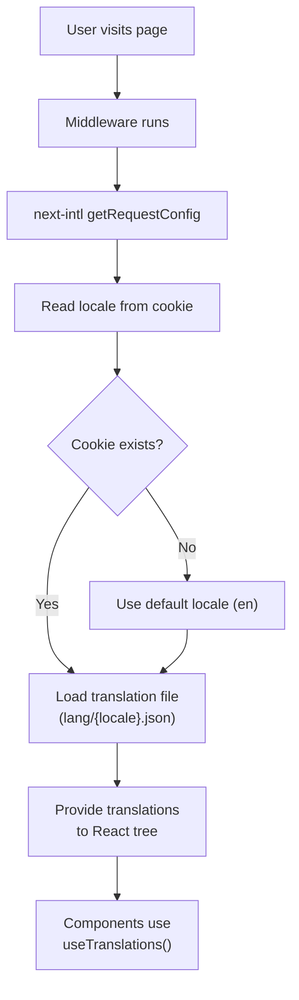

# Internationalization (i18n)

This document covers the internationalization setup, adding new languages, and the translation workflow in Hiremantis.

## Table of Contents

- [Overview](#overview)
- [Architecture](#architecture)
- [Supported Locales](#supported-locales)
- [Configuration Files](#configuration-files)
- [How It Works](#how-it-works)
- [Adding a New Language](#adding-a-new-language)
- [Using Translations in Code](#using-translations-in-code)
- [Locale Persistence](#locale-persistence)
- [UI Components](#ui-components)

---

## Overview

Hiremantis uses **next-intl v4** for internationalization. The system supports multiple languages with a cookie-based locale persistence mechanism and dynamic translation loading.

Currently active languages:

- 🇬🇧 **English** (`en`) — default
- 🇮🇳 **Hindi** (`hi`)
- 🇪🇸 **Spanish** (`es`) — defined but inactive

---

## Architecture



---

## Supported Locales

Defined in `src/i18n/config.ts`:

| Code | Language | Flag | Active                      |
| ---- | -------- | ---- | --------------------------- |
| `en` | English  | 🇬🇧   | ✅ Yes                      |
| `hi` | Hindi    | 🇮🇳   | ✅ Yes                      |
| `es` | Spanish  | 🇪🇸   | ❌ No (defined, not active) |

---

## Configuration Files

### `src/i18n/config.ts`

Defines the locale registry with metadata:

```typescript
export const locales = [
  { code: 'en', name: 'English', flag: '🇬🇧', active: true },
  { code: 'hi', name: 'Hindi', flag: '🇮🇳', active: true },
  { code: 'es', name: 'Spanish', flag: '🇪🇸', active: false },
];

export const defaultLocale = 'en';
```

### `src/i18n/request.ts`

Uses `getRequestConfig` from `next-intl/server` to dynamically import the correct translation file:

```typescript
import { getRequestConfig } from 'next-intl/server';

export default getRequestConfig(async () => {
  const locale = /* resolved from cookie or default */;
  return {
    locale,
    messages: (await import(`./lang/${locale}.json`)).default,
  };
});
```

### `src/i18n/service.ts`

Server actions for getting/setting the user's locale:

| Function                | Description                                    |
| ----------------------- | ---------------------------------------------- |
| `getUserLocale()`       | Reads locale from `next_locale._locale` cookie |
| `setUserLocale(locale)` | Sets locale cookie (1-year expiry)             |

### `next.config.ts`

The Next.js config wraps with the next-intl plugin:

```typescript
const withNextIntl = createNextIntlPlugin();
export default withNextIntl(nextConfig);
```

---

## How It Works

1. **Request arrives** → next-intl middleware reads the locale cookie
2. **No cookie** → falls back to `defaultLocale` (`en`)
3. **Translation file loaded** → `src/i18n/lang/{locale}.json` is dynamically imported
4. **Messages provided** → passed to React via next-intl provider
5. **Components translate** → use `useTranslations('namespace')` hook

---

## Adding a New Language

### Step 1: Create Translation File

Create a new JSON file at `src/i18n/lang/{code}.json` with the same structure as `en.json`:

```bash
# Copy English translations as a starting point
cp src/i18n/lang/en.json src/i18n/lang/fr.json
```

### Step 2: Translate Content

Edit the new file and translate all values (keep keys unchanged):

```json
{
  "common": {
    "welcome": "Bienvenue",
    "login": "Connexion",
    ...
  }
}
```

### Step 3: Register the Locale

Add the locale to `src/i18n/config.ts`:

```typescript
export const locales = [
  { code: 'en', name: 'English', flag: '🇬🇧', active: true },
  { code: 'hi', name: 'Hindi', flag: '🇮🇳', active: true },
  { code: 'fr', name: 'French', flag: '🇫🇷', active: true }, // ← NEW
  { code: 'es', name: 'Spanish', flag: '🇪🇸', active: false },
];
```

### Step 4: Verify

The new language will automatically appear in the language selector dropdown and be available for selection.

---

## Using Translations in Code

### In Client Components

```tsx
'use client';
import { useTranslations } from 'next-intl';

export function MyComponent() {
  const t = useTranslations('common');
  return <h1>{t('welcome')}</h1>;
}
```

### With Interpolation

```tsx
const t = useTranslations('dashboard');
// JSON: "greeting": "Hello, {name}!"
t('greeting', { name: 'John' }); // → "Hello, John!"
```

### Namespaced Access

Translation files are organized by namespace (top-level keys in the JSON):

```json
{
  "common": { "login": "Login", "logout": "Logout" },
  "dashboard": { "title": "Dashboard" },
  "jobs": { "create": "Create Job" }
}
```

```tsx
const tCommon = useTranslations('common');
const tJobs = useTranslations('jobs');
```

---

## Locale Persistence

- **Storage**: Browser cookie (`next_locale._locale`)
- **Expiry**: 1 year
- **Server Action**: `setUserLocale(locale)` updates the cookie
- **Reading**: `getUserLocale()` reads from cookie
- **Default**: Falls back to `en` if no cookie is set

---

## UI Components

### Language Selector (`src/components/language-selector.tsx`)

A dropdown component that:

1. Lists all **active** locales from the config
2. Shows the current locale with its flag
3. Calls `setUserLocale()` on selection
4. Triggers a page reload to apply the new locale

### Locale Switcher Select (`src/components/locale-switcher-select.tsx`)

An alternative switcher component for use in different layout contexts (e.g., footer, settings page).

Both components filter to only show locales where `active: true`.
